### Hello i'm Itoro Muffat

## Connect with Me

### Brief Introduction

A dedicated cybersecurity student(M.Sc) with  a profound interest in technology and a dedication to solving complex problems. I have foundational knowledge of network security, Cyber Risk Management Frameworks, and data protection. Learning to be Proficient in basic tools and technologies like firewalls, antivirus software, and penetration testing frameworks, Linux Ubuntu distribution, Debian flavor. I am committed to continuous learning, staying updated on emerging threats, and mastering best practices in securing systems and data.

### Objective
My journey in computer Electronics and Technology has led me to develop a passion for cybersecurity, and I am now eager to transition into this field, specifically aiming to join a Security Operations Center (SOC) as a Tier 1 Analyst and a network forensic expert.

### Skills Learned
Build/design a sandbox network in GNS3 and Packet tracer.
Configured the very components of the sandbox network to communicate and exchange packets using Virtualbox.
Learning to analyze and interpret network logs using the Zabbix server and Wireshark.
Learning about Encryption and Decryption using RSA and AES standards. Also learned about the Hash functions, MD5, and SHA256
Ability to generate and recognize attack signatures and patterns.
Learning to build up my knowledge of network protocols and security vulnerabilities.
Use of SSH to remotely manage the server.
Development of critical thinking and problem-solving skills in cybersecurity.

### Tools Used

VirtualBox
Ubuntu Desktop 22.04(Management)
Ubuntu Server 22.04(Gateway Router)
Bitnami Opencart(Webserver)
Security Information and Event Management (SIEM) system for log ingestion and analysis. Network Monitoring tool(Zabbix),
Network analysis tools (such as Wireshark) are used to capture and examine network traffic.
Telemetry generation tools to create realistic network traffic and attack scenarios.

### Steps to Creating a Sandbox Network

I have outlined my step-by-step implementation of a sandboxed network using VirtualBox. The network has three VMs: a Desktop VM(Ubuntu Desktop - v22.04), a Gateway VM(Ubuntu Server 22.04), and an Application VM(Bitnami Opencart) which is configured in a private sandboxed environment to ensure the network is secure and in isolated communication.
I set my assigned static IP ranges to the subnets and gateways. I selected **192.168.23.2** for my Desktop VM, **192.168.23.1** for the gateway VM interface card acting as the default gateway for the desktop, **192.168.123.1** for the gateway VM interface card acting as the default gateway for the Application VM(Bitnami Opencart), and **192.168.123.3** for my Application VM. For internet access, I also configured NAT on a third interface card on my gateway server.

Below are the three VMs I used for my sandbox network:
-	Desktop VM: Ubuntu Desktop(22.04)
-	Gateway VM: Ubuntu Server(22.04)
-	Application VM: Bitnami OpenCart   

Network Diagram designed from packet tracer.

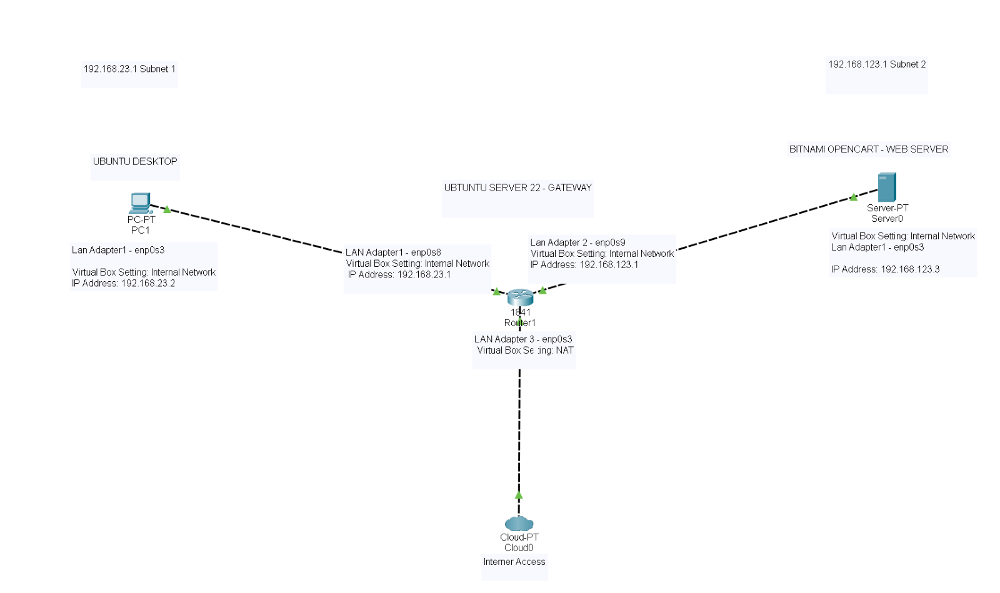   

IPTable

   

# Prerequisites
Hardware Requirements:
- A host machine with at least 16GB of RAM and a multi-core processor.
- Sufficient disk space (minimum 50GB free).

Software Requirements:
- I installed VirtualBox on the host machine.
- ISO images for the operating systems used (e.g., Ubuntu Server, Ubuntu Desktop).
- Bitnami Opencart VM for the Application Server.

Networking Knowledge:
- Basic understanding of IP addressing, routing, and firewall rules.  

# VirtualBox Setup
Creating Virtual Machines: I lunch VirtualBox and click "New" to create the desktop VM. Choose the appropriate OS type and version, allocate memory (e.g., 2GB), and create a virtual hard disk with a suitable size (e.g., 20GB). Repeat the process to create the gateway VM and Application Server VM.  

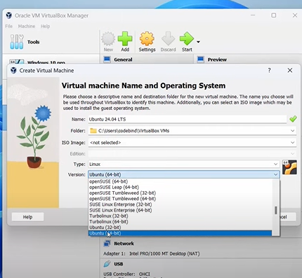  

Desktop VM:
- OS: Ubuntu Desktop.
- CPU: 2 cores.
- RAM: 4GB.
- Storage: 20GB.

Gateway VM:
- OS: Ubuntu Server.
- CPU: 2 cores.
- RAM: 2GB.
- Storage: 10GB.

Application Server VM:
- OS: Bitnami Debian WordPress.
- CPU: 2 cores.
- RAM: 4GB.
- Storage: 20GB.  

Configure Network Adapters:
- All VMs use an Internal Network to ensure isolation. I did this by going to network settings in your VirtualBox and changing the adapters from NAT to Internal Network. Rename the Application VM adapter to match the gateway adapter used to communicate with the application server.
- Configure the Gateway VM to have three adapters(adapter 1, adapter 2, adapter 3):
  - Adapter 1: Internal Network for communication with Desktop VM
  - Adapter 2: NAT for internet access.
  - Adapter 3: Internal Network for communication with Application Server VM (Rename to match with Application Server Adapter)  

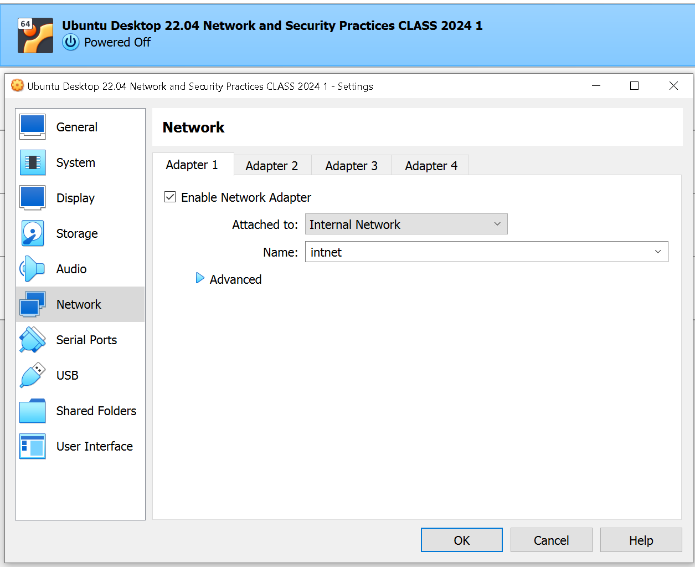   

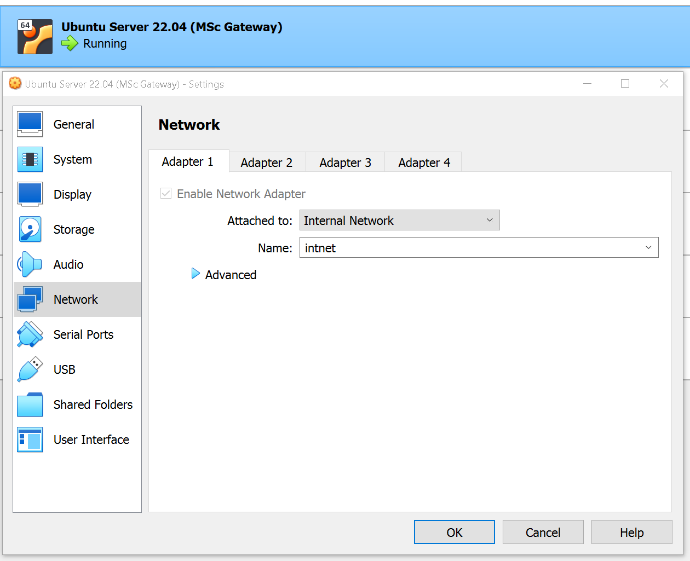   

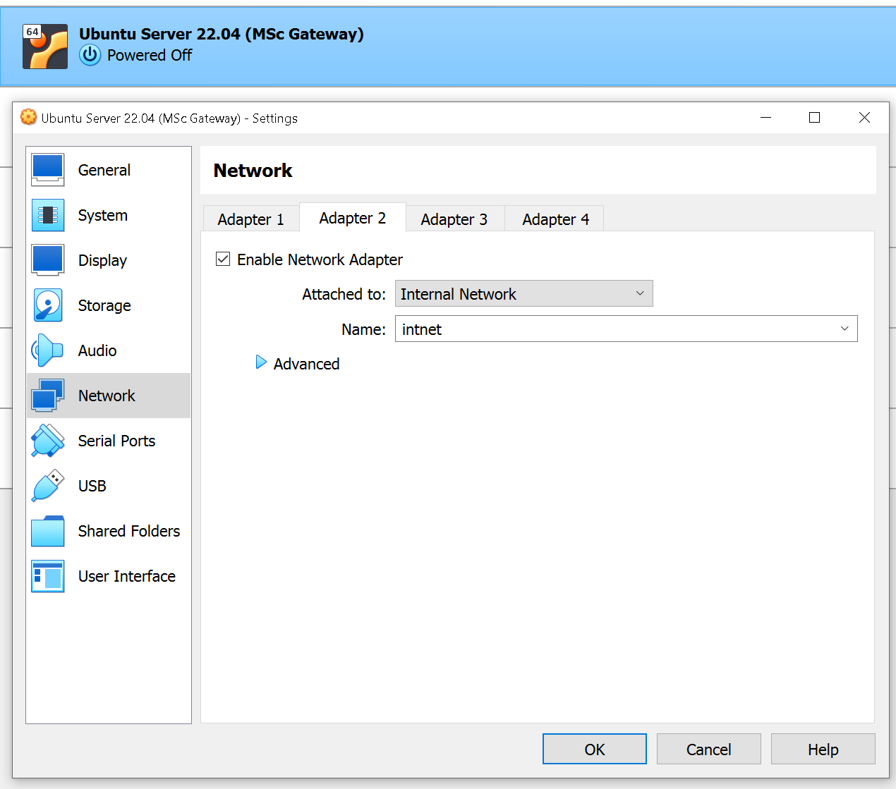   

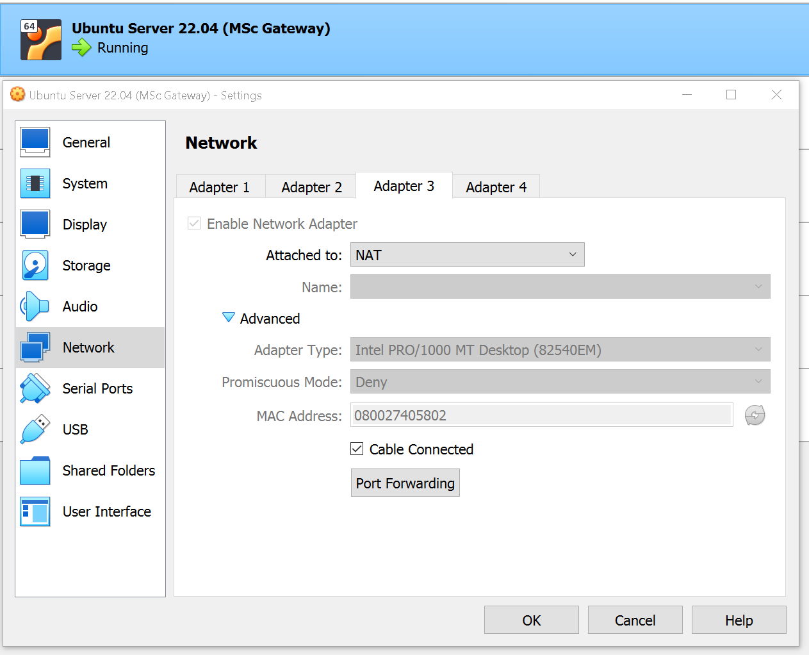   

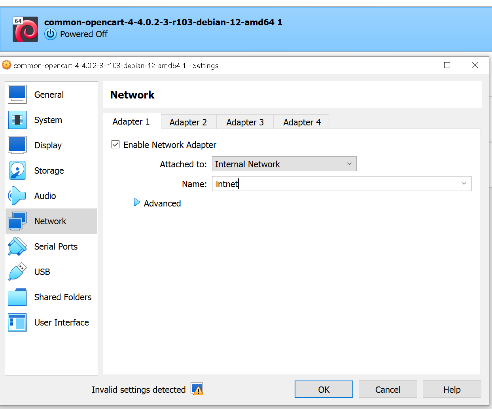   

  
# IP Configuration Steps
**Ubuntu Desktop**:

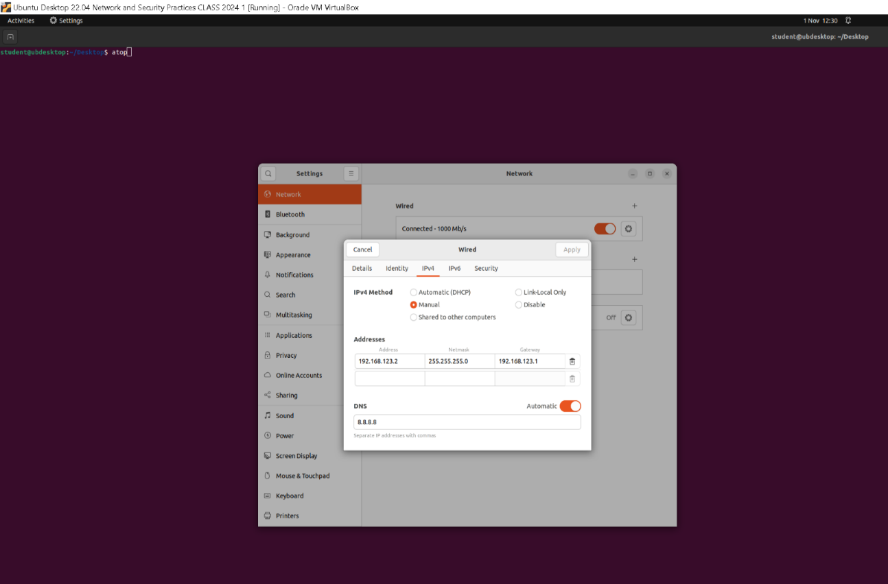   

After logging in, I assigned the IP to the Ubuntu VM by going to my IPV4 network settings and changing the method to manual to disable DHCP(Automatic Ip address assignment). I then entered the chosen IP, gateway, google dns ip and netmasks in the addresses section, Choose appropriate Mac address and applied the settings.

**Ubuntu Server**:

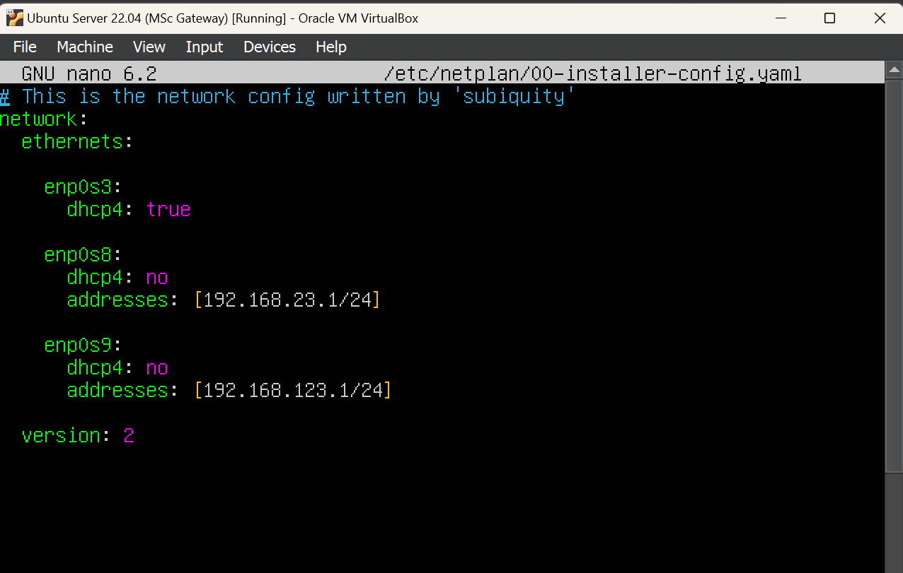   

After logging in, we I assigned static IP addresses to the appropriate network interfaces. This I did by editing the network configuration file using **sudo nano /etc/neplan/00-installer-config.yaml**. I edited the file to look like this:

network:

ethernets:

enp0s3: # This corresponds to the first interface (NAT)

dhcp4: true

enp0s8: # This corresponds to the second interface (Internal Network 1)

addresses:
- 192.168.23.1/24

dhcp4: false

enp0s9: # This corresponds to the third interface (Internal Network 2)

addresses:
- 192.168.123.1/24

dhcp4: false

version: 2  

These changes is applied with **sudo netplan apply** and enabled IP forwarding by uncommenting the **net.ipv4.ip_forward=1** line in the configuration file **/etc/sysctl.conf** and applied the changes with **sudo sysctl -p**.

Next, I configured iptables to allow forwarding using:

**Allow forwarding between enp0s8 and enp0s9**

sudo iptables -A FORWARD -i enp0s8 -o enp0s9 -j ACCEPT

sudo iptables -A FORWARD -i enp0s9 -o enp0s8 -j ACCEPT  
**Allow forwarding between enp0s3 and the internal interfaces**

sudo iptables -A FORWARD -i enp0s3 -o enp0s8 -j ACCEPT

sudo iptables -A FORWARD -i enp0s8 -o enp0s3 -j ACCEPT

sudo iptables -A FORWARD -i enp0s3 -o enp0s9 -j ACCEPT

sudo iptables -A FORWARD -i enp0s9 -o enp0s3 -j ACCEPT  
**Enable NAT on enp0s3 for internet access**

sudo iptables -t nat -A POSTROUTING -o enp0s3 -j MASQUERADE 

and made the changes permanent using:

sudo apt install iptables-persistent

sudo netfilter-persistent save

sudo netfilter-persistent reload  

**Bitnami Opencart**:

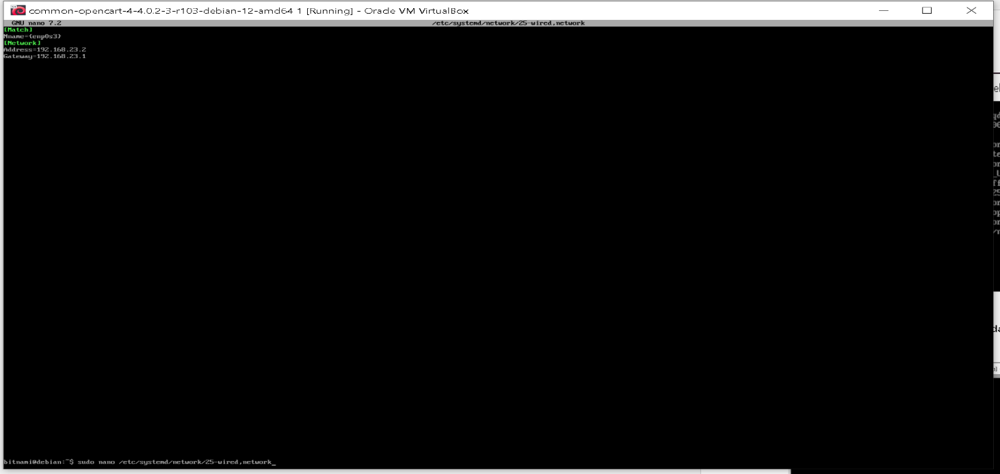   

After logging in, I applied the chosen static IP address by editing the network configuration file using **sudo nano /etc/network/interfaces**. I edited it to look like:

auto enp0s3

iface enp0s3 inet static

address 192.168.130.2

netmask 255.255.255.0

gateway 192.168.130.1

and applied changes by doing a reboot using sudo reboot.  

# Functional Test Results

# Screenshots
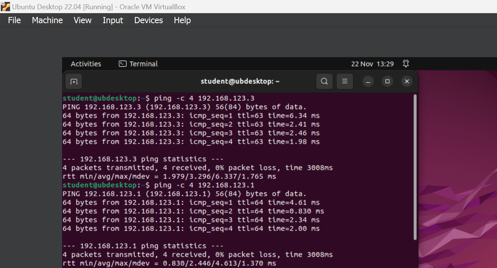   

# Screen Cast
<figure>
  <video width="640" height="360" controls>
    <source src="Screenshots/Portfolio_2_Network_and_Security_Practices_Screen_cast_3.mp4" type="video/mp4">
    Your browser does not support the video tag.
  </video>
  <figcaption>Video 1: Desktop VM (Ubuntu Desktop)</figcaption>
</figure>
  
<figure>
  <video width="640" height="360" controls>
    <source src="Screenshots/Portfolio_2_Network_and_Security_Practices_Screen_cast1.mp4" type="video/mp4">
    Your browser does not support the video tag.
  </video>
  <figcaption>Video 2: Gateway VM (Ubuntu Server)</figcaption>
</figure>
  
<figure>
  <video width="640" height="360" controls>
    <source src="Screenshots/Portfolio_2_Network_and_Security_Practices_Screen_cast2.mp4" type="video/mp4">
    Your browser does not support the video tag.
  </video>
  <figcaption>Video 3: Application VM (Bitnami Opencart)</figcaption>
</figure>
